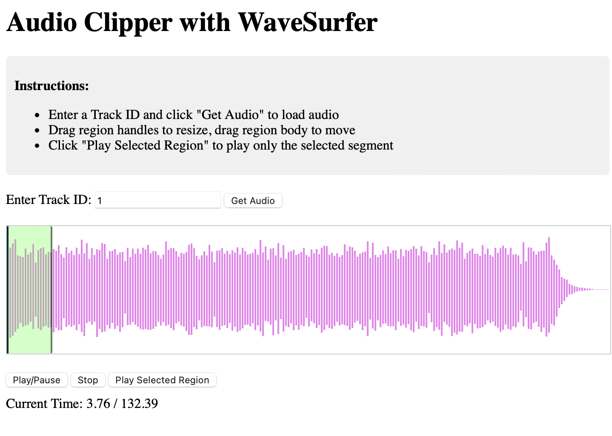

# Audio Segmentation Application

A web-based audio segmentation tool built with Flask and WaveSurfer.js that allows users to load audio files, create selectable regions, and play specific segments of audio.



## Features

- **Audio Loading**: Load audio files via Track ID from an API Gateway
- **Interactive Waveform**: Visual waveform display with real-time playback controls
- **Region Selection**: Create and manipulate a single draggable/resizable region on the waveform
- **Segment Playback**: Play only the selected region of audio
- **Real-time Controls**: Play, pause, stop, and seek through audio

## Prerequisites

- Python 3.7 or higher
- pip (Python package installer)

## Installation

1. **Clone or download the project files**

2. **Install required dependencies**:
   ```bash
   pip install Flask requests python-dotenv
   ```

3. **Set up environment variables**:
   - Create a `.env` file in the project root
   - Add your API Gateway URL:
     ```
     API_GATEWAY_URL=your_api_gateway_url_here
     ```

4. **Install python-dotenv** (if not already installed):
   ```bash
   pip install python-dotenv
   ```

## Project Structure

```
segmentation_practice/
├── app.py                          # Main Flask application
├── templates/
│   └── segment_selection.html      # Web interface template
├── .env                            # Environment variables
├── .gitignore                      # Git ignore file
└── README.md                       # This file
```

## Usage

1. **Start the application**:
   ```bash
   python app.py
   ```

2. **Access the application**:
   - Open your web browser
   - Navigate to `http://127.0.0.1:5000`

3. **Using the application**:
   - Enter a Track ID in the input field
   - Click "Get Audio" to load the audio file
   - Wait for the waveform to load
   - A green region will appear automatically (0-10 seconds)
   - Drag the region handles to resize or drag the region body to move
   - Use the controls to play/pause/stop audio
   - Click "Play Selected Region" to play only the selected segment

## API Integration

The application integrates with an API Gateway to fetch audio URLs:

- **Endpoint**: `/audio/<track_id>`
- **Method**: GET
- **Response**: JSON with `signed_url` field containing the audio file URL

## Environment Variables

Create a `.env` file with the following variable:

```
API_GATEWAY_URL=https://your-api-gateway-url.amazonaws.com/endpoint
```

## Security

- The `.env` file is included in `.gitignore` to prevent sensitive URLs from being committed to version control

## Dependencies

- **Flask**: Web framework for the backend
- **requests**: HTTP library for API calls
- **python-dotenv**: Environment variable management
- **WaveSurfer.js**: Audio waveform visualization and manipulation

## Troubleshooting

### Common Issues

1. **Audio not loading**:
   - Check that your API Gateway URL is correct in the `.env` file
   - Verify the Track ID exists in your system
   - Check browser console for error messages

2. **Regions not appearing**:
   - Ensure the audio has loaded completely
   - Check browser console for WaveSurfer.js errors
   - Try refreshing the page

3. **Playback issues**:
   - Verify the audio file format is supported (MP3, WAV, OGG)
   - Check that the region start time is less than end time

### Debug Information

The application includes console logging for debugging:
- WaveSurfer.js initialization status
- Region creation and updates
- Audio loading progress
- Error messages
